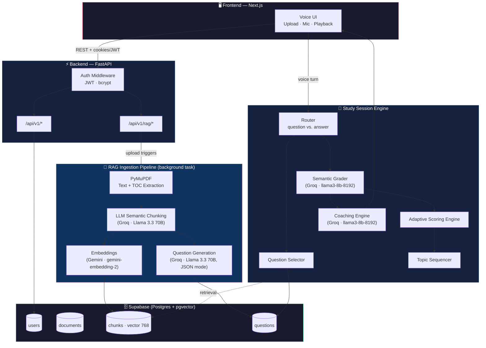
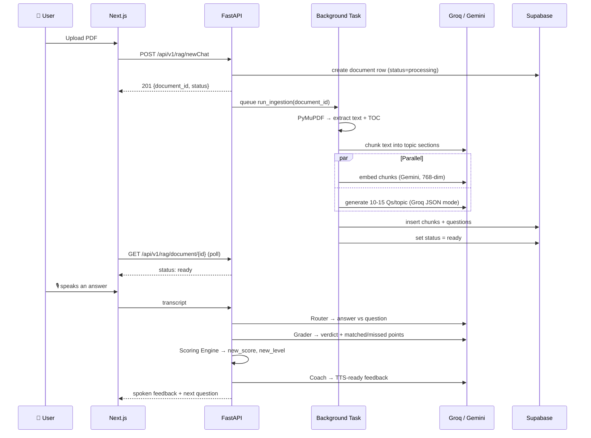

<div align="center">

# 🎙️ Voice AI Study Coach

### An adaptive, voice-first study companion that turns any PDF into a personal oral exam.

<em>Upload your notes → It reads, understands, and chunks them → It asks you questions out loud →
You answer out loud → It grades your understanding semantically → It adapts difficulty in real time.</em>

<br/>


<br/>

[Problem](#-the-problem) •
[Solution](#-the-solution) •
[Architecture](#%EF%B8%8F-system-architecture) •
[Tech Stack](#-tech-stack) •
[Models](#-models-in-play) •
[Pipeline](#-the-rag--grading-pipeline) •
[API](#-api-reference) •
[Getting Started](#-getting-started) •
[Roadmap](#%EF%B8%8F-roadmap)

</div>

<br/>

## 📌 The Problem

Studying from static PDFs is a **passive, one-way street**:

| Pain Point | Why it hurts |
|---|---|
| 📖 **Passive reading** | Skimming notes *feels* like learning but rarely tests real recall |
| ❓ **No self-testing loop** | Making your own quiz questions from a 50-page PDF is tedious, so most students skip it |
| 🎯 **One-size-fits-all difficulty** | Generic flashcard apps don't adapt to *your* actual weak spots |
| 🗣️ **No verbal practice** | Exams and interviews are spoken/written under pressure — silently re-reading a PDF doesn't train that muscle |
| 🤖 **Dumb grading** | Keyword-matching quiz tools mark a correct answer "wrong" just because you phrased it differently |

> **In short:** students have the material, but no fast, adaptive, conversational way to *prove to themselves* they've actually learned it.

<br/>

## 💡 The Solution

**Voice AI Study Coach** turns a PDF (lecture notes, textbook chapter, slides) into a **voice-driven, adaptive oral quiz session**:

1. 📤 **Upload** a PDF — it's parsed and split into topic-aware sections.
2. 🧠 **Auto-generate** 10–15 questions per topic across 5 difficulty levels, each with an ideal answer + key semantic points.
3. 🎙️ **Ask & answer out loud** — the agent poses a question, you respond by voice.
4. ⚖️ **Semantic grading** — an LLM checks your answer against *meaning*, not keywords, and returns matched/missed points with a confidence score.
5. 📈 **Adaptive difficulty** — your running score nudges the next question's difficulty up or down (exponential moving average, level range 1–5).
6. 🗣️ **Spoken coaching** — a second LLM pass turns the grading verdict into short, encouraging, TTS-ready feedback.

The result feels less like a quiz app and more like **a patient tutor quizzing you on your own notes.**

<br/>

## 🏗️ System Architecture



<br/>

## 🧰 Tech Stack

<table>
<tr><th>Layer</th><th>Technology</th><th>Purpose</th></tr>

<tr><td rowspan="4"><strong>🎨 Frontend</strong></td>
<td><strong>Next.js (React)</strong></td><td>App UI — upload flow, voice session screen, dashboards</td></tr>
<tr><td>Web Audio / MediaRecorder API</td><td>Capturing microphone input for voice answers</td></tr>
<tr><td>TypeScript</td><td>Type-safe frontend codebase</td></tr>
<tr><td>Tailwind CSS <em>(planned)</em></td><td>Styling</td></tr>

<tr><td rowspan="6"><strong>⚙️ Backend</strong></td>
<td><strong>FastAPI</strong></td><td>Async REST API, background tasks for ingestion</td></tr>
<tr><td>Uvicorn</td><td>ASGI server</td></tr>
<tr><td>Pydantic</td><td>Request/response & LLM structured-output schemas</td></tr>
<tr><td>PyJWT + bcrypt</td><td>Stateless auth (HttpOnly cookie / Bearer token) + password hashing</td></tr>
<tr><td>PyMuPDF (fitz)</td><td>PDF text & table-of-contents extraction</td></tr>
<tr><td>python-multipart / aiofiles</td><td>File upload handling</td></tr>

<tr><td rowspan="2"><strong>🗄️ Data</strong></td>
<td><strong>Supabase (Postgres)</strong></td><td>Users, documents, chunks, questions — relational store</td></tr>
<tr><td><strong>pgvector</strong></td><td>768-dim vector column for semantic chunk retrieval</td></tr>

<tr><td rowspan="4"><strong>🧠 AI / LLM Orchestration</strong></td>
<td><strong>LangChain</strong> (core, community, classic)</td><td>LLM clients, structured-output parsing, prompt templates</td></tr>
<tr><td>langchain-groq / langchain-google-genai / langchain-cerebras / langchain-ollama</td><td>Provider-specific chat & embedding integrations</td></tr>
<tr><td>Custom Key-Rotation Pool</td><td>Round-robins multiple API keys per provider, auto-cools down rate-limited keys</td></tr>
<tr><td>Custom Exception + Logger</td><td>Centralized error wrapping (<code>CustomException</code>) and file-based session logging</td></tr>

<tr><td><strong>🧪 Tooling</strong></td>
<td>Jupyter, python-dotenv, setuptools</td><td>Notebooks for experimentation, env config, packaging</td></tr>
</table>

<br/>

## 🤖 Models In Play

<table>
<tr>
<th>Stage</th>
<th>Provider</th>
<th>Model</th>
<th>Temp</th>
<th>Why this model</th>
</tr>
<tr>
<td>📑 Semantic Chunking</td>
<td>Groq</td>
<td><code>llama-3.3-70b-versatile</code></td>
<td>0.0</td>
<td>Deterministic structural parsing of noisy PDF text into topic sections</td>
</tr>
<tr>
<td>❓ Question Generation</td>
<td>Groq</td>
<td><code>llama-3.3-70b-versatile</code> <em>(JSON mode)</em></td>
<td>0.1</td>
<td>Reliable structured JSON output; avoids Groq's brittle native tool-calling on short fields</td>
</tr>
<tr>
<td>🧬 Embeddings</td>
<td>Google Gemini</td>
<td><code>gemini-embedding-2</code> <em>(768-dim)</em></td>
<td>—</td>
<td>Output dimensionality pinned to 768 to match the Postgres <code>vector(768)</code> column</td>
</tr>
<tr>
<td>⚖️ Semantic Grading</td>
<td>Groq</td>
<td><code>llama3-8b-8192</code></td>
<td>0.0</td>
<td>Fast, deterministic verdicts (correct / partial / wrong / dont_know / unclear) — never keyword matching</td>
</tr>
<tr>
<td>🗣️ Coaching Feedback</td>
<td>Groq</td>
<td><code>llama3-8b-8192</code></td>
<td>0.5</td>
<td>Warmer, more natural spoken-style encouragement; TTS-ready plain text</td>
</tr>
<tr>
<td>🔀 Router</td>
<td>Groq</td>
<td><code>ChatGroq</code> + structured <code>RouteDecision</code></td>
<td>—</td>
<td>Classifies each voice turn as a new question vs. an answer to the current one</td>
</tr>
</table>

> ⚡ **Resilience by design:** every Groq / Gemini / Cerebras call pulls a key from a `KeyPool` that round-robins across multiple API keys per provider (`GROQ_API_KEY_1..n`, `GEMINI_API_KEY_1..n`, `CEREBRAS_API_KEY_1..n`) and automatically cools down any key that gets rate-limited (HTTP 429), retrying on the next available one.

<br/>

## 🔄 The RAG + Grading Pipeline



**Pipeline stages, in order:**

1. **Ingestion trigger** — `POST /api/v1/rag/newChat` uploads a PDF, creates a `documents` row, and schedules `run_ingestion` as a FastAPI background task.
2. **Parsing** — `PyMuPDF` extracts raw text page-by-page plus the PDF's table of contents (used as chunking hints).
3. **Chunking** — the text is windowed (150 lines at a time) and sent to Groq to detect topic/section boundaries, producing ordered, deduplicated sections.
4. **Embedding + Question Generation (parallel)** — chunks are simultaneously embedded (Gemini) and expanded into 10–15 graded questions per topic (Groq, JSON mode) via `asyncio.gather`.
5. **Persistence** — chunks (with embeddings) and questions are written to Supabase; the document status flips to `ready` (or `failed` with an error message).
6. **Study session loop** — once a document is `ready`, the session engine:
   - **Selects** a question by topic/difficulty (`QuestionSelector`)
   - **Routes** each spoken turn as answer vs. new question (`RouteDecision`)
   - **Grades** answers semantically against key points (`Grading` → `GradeVerdict`)
   - **Scores** adaptively: `new_score = 0.7 × previous_score + 0.3 × points(verdict)`, bumping difficulty level up past 0.75 and down below 0.40
   - **Sequences** topic progression once enough questions are answered
   - **Coaches** — turns the verdict into short, encouraging spoken feedback

<br/>

## 📂 Project Structure

```
Voice Agent/
├── backend/                  # FastAPI application
│   ├── app.py                 # App entrypoint, router registration
│   ├── controllers/           # Request handlers (rag, user)
│   ├── routes/                 # Route definitions
│   ├── middlewares/            # JWT auth middleware
│   ├── models/                 # Pydantic request/response schemas
│   ├── services/                # Background pipeline orchestration
│   └── utils/                   # DB helper functions
├── llm/                       # AI core
│   ├── rag/                    # chunking · embedding · generation · ingestion
│   ├── grading/                 # routing · grading · scoring · sequencing · selection · coaching
│   ├── prompts.py                # Centralized prompt templates
│   ├── schemas.py                 # Pydantic structured-output schemas
│   └── rotation_shifting.py        # Multi-key rate-limit-aware key pool
├── supabase_client/            # Supabase client singleton
├── src/                        # Shared logger + custom exception handling
├── frontend/                   # Next.js app (in progress)
├── ocr-testing/                # OCR / chunking experiments
├── testing/                    # Notebooks + sample docs
└── requirements.txt
```

<br/>

## 🔌 API Reference

<table>
<tr><th>Method</th><th>Endpoint</th><th>Auth</th><th>Description</th></tr>
<tr><td><code>POST</code></td><td><code>/api/v1/signup</code></td><td>—</td><td>Create a user (bcrypt-hashed password)</td></tr>
<tr><td><code>POST</code></td><td><code>/api/v1/login</code></td><td>—</td><td>Verify credentials, issue JWT as an HttpOnly cookie</td></tr>
<tr><td><code>DELETE</code></td><td><code>/api/v1/logout</code></td><td>✅ JWT</td><td>Clear the session cookie</td></tr>
<tr><td><code>POST</code></td><td><code>/api/v1/rag/newChat</code></td><td>✅ JWT</td><td>Upload a PDF; creates a document row and queues ingestion</td></tr>
<tr><td><code>GET</code></td><td><code>/api/v1/rag/document/{document_id}</code></td><td>✅ JWT</td><td>Poll ingestion status: <code>processing</code> → <code>ready</code> / <code>failed</code></td></tr>
<tr><td><code>GET</code></td><td><code>/api/v1/rag/documents</code></td><td>✅ JWT</td><td>List all documents for the logged-in user</td></tr>
</table>

<br/>

## 🚀 Getting Started

### Prerequisites

- Python 3.14
- Node.js ≥ 18 (for the Next.js frontend)
- A [Supabase](https://supabase.com) project with `pgvector` enabled
- API keys: Groq, Google Gemini, Cerebras (optional), Hugging Face (optional)

### 1️⃣ Clone & set up the backend

```bash
git clone <repo-url> "Voice Agent"
cd "Voice Agent"

python -m venv venv
venv\Scripts\activate        # Windows
# source venv/bin/activate   # macOS/Linux

pip install -r requirements.txt
```

### 2️⃣ Configure environment variables

Create a `.env` file in the project root:

```env
# --- LLM providers (numbered = key rotation pool, or a single unnumbered var) ---
GROQ_API_KEY_1=your_groq_key_1
GROQ_API_KEY_2=your_groq_key_2
GEMINI_API_KEY_1=your_gemini_key_1
GEMINI_API_KEY_2=your_gemini_key_2
CEREBRAS_API_KEY_1=your_cerebras_key_1
HUGGING_FACE_TOKEN=your_hf_token

# --- Supabase ---
SUPABASE_URL=https://xxxx.supabase.co
SUPABASE_PUBLISHABLE_KEY=your_supabase_key

# --- Auth ---
JWT_SECRET_KEY=your_super_secret_key
```

### 3️⃣ Run the backend

```bash
uvicorn backend.app:app --reload
```

The API is now live at `http://localhost:8000` — interactive docs at `http://localhost:8000/docs`.

### 4️⃣ Run the frontend (Next.js)

```bash
cd frontend
npm install
npm run dev
```

The app is now live at `http://localhost:3000`.

<br/>

## 🗺️ Roadmap

- [x] PDF ingestion pipeline (parse → chunk → embed → generate)
- [x] JWT-based auth with Supabase
- [x] Adaptive semantic grading + scoring engine
- [x] Topic sequencing + question selection
- [ ] Next.js frontend (upload UI, voice session screen)
- [ ] Speech-to-Text integration (voice input)
- [ ] Text-to-Speech integration (voice output for questions & coaching)
- [ ] Real-time voice session over WebSockets
- [ ] Progress dashboard & analytics per document/topic
- [ ] Deployment (backend + frontend)

<br/>

<div align="center">

### 👤 Author

**Shiva**: 📧 shivachatti190@gmail.com

**Shiva Kumar**: 📧 mshivakumar1289@gmail.com

<sub>Built with FastAPI, LangChain, Groq, Gemini, Supabase & Next.js</sub>

</div>
